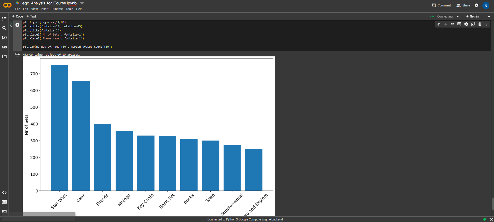

# Pandas and Matplotlib Operations - Day 74

This repository documents my exploration of Pandas and Matplotlib operations as part of my #100DaysOfCode challenge.

## Learning Points & Summary

- **Using HTML Markdown in Notebooks:**

  - Utilized Markdown syntax, such as section headings (#) and embedding images with the `` tag.

- **Aggregating Data:**

  - Combined `groupby()` and `count()` functions to aggregate data.
  - Used `.value_counts()` function for frequency counts.

- **Slicing DataFrames:**

  - Employed square bracket notation to slice DataFrames, e.g., `df[:-2]` or `df[:10]`.

- **Applying Operations:**

  - Utilized the `.agg()` function to perform operations on specific columns.
  - Renamed columns of DataFrames using `.rename()`.

- **Visualizing Data:**

  - Created a line chart with dual axes to visualize data with different scales.
  - Generated a scatter plot using Matplotlib.
  - Constructed a bar chart with Matplotlib.

- **Working with Relational Data:**
  - Interacted with tables in a relational database, employing primary and foreign keys.
  - Merged DataFrames using `.merge()` along a specified column.

## Example Image

## GitHub Repository

Find the code and examples on GitHub:
[GitHub Repository](https://github.com/imnilesh18/Python-Projects)
